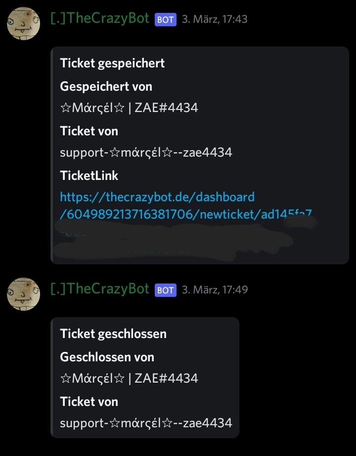

<h5> Die Beispiele werden in [] geschrieben.</h5>

### /t add

```
/t add kategorie: [Support] chat: [Ticketsystem] log: [ticketlog]
```

Die Kategorie ist das wo die Tickets chats erstellt werden sollen.

Das Panel wird immer im *Chat* rein gesendet.

Das Log logt wer das Ticket schließt oder speichern tut.


________________________

### /t ticket

```
/t ticket name: [Support] description: [Das ist das normale Support Ticket] emoji: [📃] text: [Hallo, schreibe dein Anliegen in den Chat.] role1: [@Supporter] role2: [@Supporter] role3: [@Supporter]
```

Der Name ist das Ticketname gemeint.

Die Discription ist die die man im Dropdown Menü, so wie das Emoji. 

Der Text ist die Nachricht, die im erstellten Ticket rein gesendet wird.


Die Rollen können das Ticket sehen, bearbeiten, schließen und speichern. 
[PS. Wenn man die Rollen nicht hat kann man auch nicht das Ticket schließen und speichern, außer man hat eine bestimmte Berechtigung Server verwaltung.]


________________________

### /t embed

```
/t embed titel: [Ticket Übersicht] description: [Wenn du Hilfe brauchst suche dir ein Ticket aus.>>Wenn es ausgenutzt wird, wird der User aus den Support System entfernt.]
```

Die > ist da um eine Zeile runter zu gehen. 

 

import Tabs from '@theme/Tabs';
import TabItem from '@theme/TabItem';

<Tabs>
  <TabItem value="apple" label="Apple" default>
    This is an apple 🍎
  </TabItem>
  <TabItem value="orange" label="Orange">
    This is an orange 🍊
  </TabItem>
  <TabItem value="banana" label="Banana">
    This is a banana 🍌
  </TabItem>
</Tabs>
