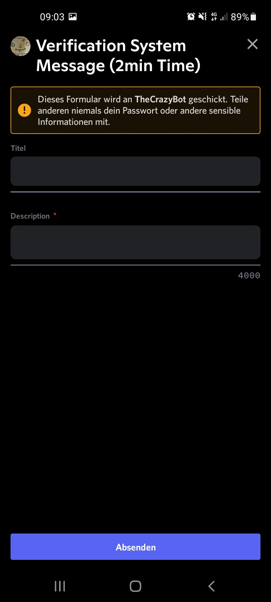

<h3> Die Beispiele werden in [ ] geschrieben.</h3>


### /verification-system add


```

/verification-system add role:[@test] chat:[#test] message:[mit Message]

oder

/verification-system add role:[@test] chat:[#test] message:[nur Button] 

```


<h2>nur Button</h2>


<h2>mit Message</h2>




<h2>Message erstellen</h2>

________________________


###/verification-system remove


```

/verification-system remove

```
